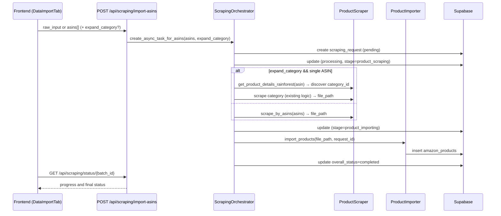

# ASIN List Import – Minimal Change Design

This document proposes a minimal-change design to support importing products directly from a user-provided list of ASINs, while keeping the existing URL-based import flow intact. The new capability reuses current progress UX, status polling, importer, and processor logic.

## Goals
- Allow users to paste up to 500 ASINs into the existing URL input field.
- Robust tokenization: accept whitespace, commas, Chinese commas, semicolons, colons, dashes, tabs, and newlines as delimiters; case-insensitive; de-duplicate.
- If exactly one ASIN is entered, prompt the user to confirm:
  - A) import only this ASIN; or
  - B) import this ASIN plus top 100 products from its category (default to Best Sellers for consistency with current category flow).
- Reuse the existing Importer and Result Processor; do not change downstream schemas.
- Reuse existing async orchestration and status polling endpoints/structures.

## Frontend (Data Import Tab)
File: `frontend/src/components/tabs/data-import-tab.tsx`

### Input Parsing
- Continue using the same single input field (currently labeled Amazon URL).
- Before deciding which backend endpoint to call, extract ASINs with a global regex and permissive delimiters:
  - Normalize to uppercase.
  - Global regex: `[A-Z0-9]{10}` (acceptable ASIN tokens).
  - Delimiters accepted implicitly by regex scanning: space, `,`, `，`, `;`, `；`, `:`, `：`, `-`, `\n`, `\t`.
  - De-duplicate; limit to max 500.

### Branching Logic
- If extracted ASIN count >= 1:
  - If count == 1: show a confirmation modal with two options:
    - "Import this ASIN only" → call ASIN import API without expansion.
    - "Import this ASIN + top 100 products in its category (Best Sellers)" → call ASIN import API with `expand_category=true` (see backend section).
  - If count > 1: call ASIN import API with the full list (no expansion).
- Else (no valid ASIN tokens found): fall back to the existing URL flow (POST `/api/scraping/process-url`).

### API Calls (No UI redesign)
- New endpoint: `POST /api/scraping/import-asins`
  - Request (Option 1 – server parses raw):
    ```json
    { "raw_input": "<user pasted text>", "expand_category": false }
    ```
  - Request (Option 2 – client provides parsed list):
    ```json
    { "asins": ["B00ABC1234", "B00DEF5678", ...], "expand_category": false }
    ```
  - Response (same shape as existing async start):
    ```json
    {
      "task_id": "12345",
      "batch_id": 12345,
      "status": "started",
      "overall_status": "running",
      "products_phase": { "status": "running" },
      "reviews_phase": { "status": "pending" }
    }
    ```
- Poll progress via existing `GET /api/scraping/status/{batch_id}`. No UI changes needed for progress display.

## Backend

### New Endpoint
File: `backend/main.py`

- Add `POST /api/scraping/import-asins`:
  - Accepts either `raw_input` or `asins: string[]` and optional `expand_category` (bool, default `false`).
  - Parses, validates, de-duplicates ASINs; returns error if none valid or beyond max (500).
  - Starts an async task through the orchestrator and immediately returns `{ task_id, batch_id, ... }` in the same format as `/api/scraping/process-url`.

### Orchestration
File: `backend/scraping/orchestrator.py`

- Add an async method, e.g., `create_async_task_for_asins(asins: List[str], expand_category: bool = False)`:
  1) Create a scraping request record with `status=pending`, set `workflow_stage=product_scraping`, and mark request type as `asin_list`.
  2) If `expand_category` is true and exactly one ASIN is provided:
     - Fetch product details (see below) to discover `category_id`.
     - Use the existing category scraping pathway to get top products (by default, use Best Sellers path for consistency with current category flows; see "Category 100 behavior" note below).
  3) Else: call `ProductScraper.scrape_by_asins(asins)` to fetch details for each ASIN only.
  4) Update stage to `product_importing`, then call `ProductImporter.import_products(file_path, request_id)`.
  5) Mark completion or failure and emit progress events for the existing polling API to read.

### Product Scraper
File: `backend/scraping/products/scraper.py`

- Add:
  ```python
  async def scrape_by_asins(self, asins: List[str], concurrency: int = 8, max_retries: int = 3) -> Dict[str, Any]
  ```
  - Normalize and de-duplicate ASINs.
  - For each ASIN, call `get_product_details_rainforest(asin)` with retry and modest concurrency.
  - Collect successfully fetched `product` objects into a list.
  - Save a single file under `backend/scraping/data/scraped/amazon/amazon_asins_{hash}_{timestamp}.json` with structure:
    - `scraping_summary: { type: "asin_list", total_products, ... }`
    - `category_results: [ {..product..}, ... ]` (matches Importer expectations)
  - Return `{ status: "success", file_path, products_scraped }` or the appropriate error shape.

### Importer & Processor (No Changes)
- `ProductImporter.import_products(...)` remains unchanged.
- `ScrapingResultProcessor` already supports reading array data from `category_results` and mapping to `amazon_products`.

## Single-ASIN Confirmation Behavior
- When only one ASIN is detected on input:
  - Option A: Import only this ASIN → `expand_category=false`.
  - Option B: Import this ASIN plus top 100 in its category → `expand_category=true` (default mode uses Best Sellers path). The orchestrator will:
    - Fetch that ASIN's details → derive `category_id`.
    - Invoke the existing category scraping method (see current logic below) to gather up to the target count, then import.
- Note: If later we need to support the category "listing" API rather than Best Sellers, we can add a `category_mode: "bestsellers" | "listing"` parameter. For now, default to Best Sellers to stay consistent with current category flows for non-product URLs.

## Category 100 Behavior (Current Logic)
- In `ProductScraper._scrape_category_products`:
  - If `url_type == "product"`: it uses `get_products_from_category_rainforest` (category listing) to get products, then enriches each ASIN with details.
  - Else (category/bestsellers URLs): it constructs the Best Sellers URL and calls `get_bestsellers_rainforest`, then enriches each ASIN with details.
- Therefore, for a general category flow (not started from a product URL), the top N are Best Sellers. For a product URL-derived category, the listing API is used.

## Error Handling & Limits
- Invalid or zero valid ASINs → immediate error response.
- De-duplicate ASINs; cap at 500 per request.
- Apply retry/backoff on detail fetches; record partial successes.
- Maintain existing status fields (`overall_status`, `workflow_stage`, phased statuses) so the current progress UI works unchanged.

## Sequence (ASIN list)


## Out of Scope (This Phase)
- Changing project creation to accept ASIN lists (can be added later via `filters.product_asins`).
- Reviews scraping for ASIN list imports.
- UI redesign; we only add a confirmation step for single-ASIN inputs and reuse the current progress layout.


