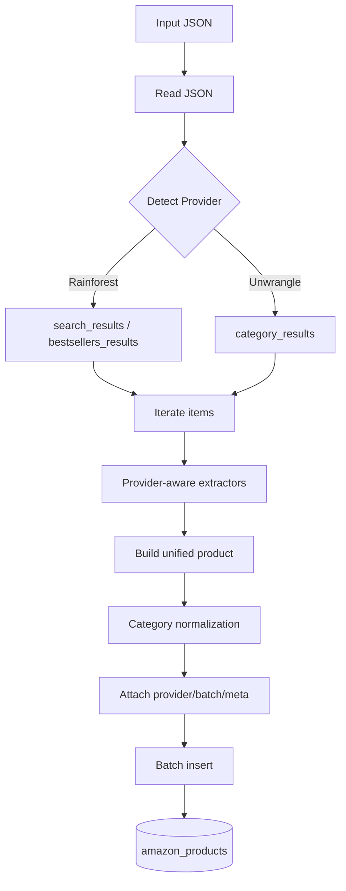

# Scraping 模块设计说明

## 概述
Scraping 模块负责 Amazon 商品和评论数据的爬取与导入，采用模块化设计，支持独立的商品爬取和评论爬取，并提供统一的编排器管理整个流程。

## 核心职责
- **商品爬取**: 从 Amazon 页面爬取商品基本信息
- **评论爬取**: 批量爬取商品评论数据
- **数据导入**: 将爬取的数据标准化后导入数据库
- **流程编排**: 统一管理爬取和导入的完整流程

## 目录结构
```
scraping/
├── products/           # 商品相关
│   ├── scraper.py     # 商品爬取器
│   └── importer.py    # 商品导入器
├── reviews/            # 评论相关
│   ├── scraper.py     # 评论爬取器
│   └── importer.py    # 评论导入器
├── common/            # 通用组件
│   ├── amazon_api.py  # Amazon API 封装
│   └── result_processor.py # 结果处理器
├── data/              # 数据存储
├── orchestrator.py    # 流程编排器
└── __init__.py
```

## 主要组件

### 商品模块 (Products)
- **ProductScraper**: 商品爬取器
  - 支持分类页面和搜索结果页面爬取
  - 自动解析商品基本信息（标题、价格、评分等）
  - 支持分页爬取和数量限制
- **ProductImporter**: 商品导入器
  - 数据清洗和标准化
  - 批量插入数据库
  - 重复数据检测和处理

### 评论模块 (Reviews)
- **ReviewScraper**: 评论爬取器
  - 基于商品ID批量爬取评论
  - 支持时间范围筛选
  - 自动处理分页和反爬限制
- **ReviewImporter**: 评论导入器
  - 评论数据结构化处理
  - 批量导入优化
  - 数据完整性检查

### 通用组件 (Common)
- **AmazonAPI**: Amazon 接口封装
  - 统一的请求处理
  - 反爬策略（随机延时、User-Agent 轮换）
  - 错误重试机制
- **ScrapingResultProcessor**: 结果处理器
  - 数据格式标准化
  - 结果文件管理
  - 状态跟踪

### 编排器 (Orchestrator)
- **ScrapingOrchestrator**: 流程编排器
  - 统一的入口点管理
  - 支持三种工作模式：
    - 完整流程：爬取商品 → 导入商品 → 爬取评论 → 导入评论
    - 仅商品：爬取商品 → 导入商品
    - 仅评论：爬取评论 → 导入评论

## 工作流程

### 完整流程
1. 解析 Amazon URL
2. 爬取商品列表
3. 清洗并导入商品数据
4. 获取商品ID列表
5. 批量爬取商品评论
6. 清洗并导入评论数据

### 数据存储
- **原始数据**: JSON 格式存储在 data/scraped 目录
- **处理后数据**: 通过 Core 模块导入 Supabase 数据库
- **批次管理**: 每次爬取生成唯一批次ID进行追踪

## 技术特性
- **异步处理**: 基于 asyncio 的异步爬取
- **错误恢复**: 支持断点续传和失败重试
- **限流控制**: 自动控制请求频率，避免被封
- **数据去重**: 自动检测和处理重复数据

## 扩展说明
- **新增平台**: 在 common 目录添加新的 API 封装
- **自定义处理**: 继承 Scraper 和 Importer 基类
- **监控集成**: 通过编排器状态接口进行监控 

## Unwrangle 导入兼容（新增）

- 新增了独立的导入工具目录 `unwrangle_into_DB/`，用于将 Unwrangle 的 `category_results` JSON 直接导入到 `amazon_products` 表中，且完整保留额外字段（以 text/jsonb 形式）。
- 类目字段保持与现有 RF 流程一致：`category`（末级名称）、`category_id`（末级ID）、`categories_flat`、`category_l1_id..category_l6_id`、`category_deepest_level`、以及 `category_hierarchy`（仅此列写入）。
- 布尔型源数据以文本形式写入（例如 "true"/"false"），以兼容当前表结构。

### 使用

```bash
python unwrangle_into_DB/import_unwrangle_products.py --file backend/scraping/data/scraped/amazon/amazon_product_cat_6291359011_20250717_033759.json --batch-id 9999
python unwrangle_into_DB/import_unwrangle_products.py --file backend/scraping/data/scraped/amazon/amazon_product_cat_507840_20250717_034918.json --batch-id 9998
```

> 后续将以最小改动把提供者检测与适配器整合进现有导入流程，保持现有逻辑稳定，仅在适配层新增处理。

---

## Data Import – RF + Unwrangle (Unified Plan)

This section describes how the unified import will work after integrating Unwrangle into the existing data import flow with minimal changes.

### Goals
- Single sink table: `amazon_products` (both RF and Unwrangle).
- Keep downstream logic unchanged by normalizing categories and base fields identically.
- Preserve Unwrangle extra dimensions (stored as text/jsonb). Boolean values are stored as text for compatibility.
- Only write category hierarchy to `category_hierarchy` and ignore `categories_hierarchy` for writes.

### High-level Flow
1) Read JSON file → Detect provider (RF or Unwrangle)
2) Select provider-aware adapter (existing RF extractor vs. new Unwrangle adapter)
3) Normalize base fields (asin/title/brand/price/list_price/rating/reviews/image/product_url/availability/...)
4) Normalize categories (leaf name/id, flat path, `category_l1..l6`, `category_deepest_level`, `category_hierarchy` JSON)
5) Preserve Unwrangle extras into dedicated text/jsonb columns (e.g., `buybox_json`, `images_json`, `keywords_list_json`, etc.)
6) De-duplicate by `platform_id` → Batch insert (or upsert if enabled)

Simplified sequence (Mermaid):


### Provider Detection
- If top-level contains `request_parameters` and `category_results` → `unwrangle`.
- Else if `search_results` or `bestsellers_results` → `rainforest`.
- Else fallback to best-effort list signature → `rainforest`.

### Minimal Code Changes (planned)
We keep edits as small as possible and isolate new logic.

- File: `backend/scraping/common/result_processor.py`
  - Add `_detect_provider(data) -> str` and call it in `process_scraping_result` (2 edits)
  - In `_process_single_product`:
    - set `source = 'amazon'` and add `data_provider` field
    - for Unwrangle: override image picking via `main_image.link` → fall back to `images[0].link`
    - map Unwrangle extras into prepared columns (text/jsonb) when present (1 edit block)
  - Availability/price/list_price/rating/reviews: extend helpers to read Unwrangle `buybox_winner.*` and `rating_breakdown` as fallbacks (3 small edits)
  - Category normalization remains unchanged (already compatible)
  - Estimated edits in this file: 6–8 locations

- File: `backend/scraping/products/importer.py` (or `backend/core/services/data_import_service.py`)
  - No behavior change required; importer continues to call the processor. Optionally pass through a `batch_id` override used during tests (1 small edit if needed).

- Optional helper (nice-to-have, not required): `backend/scraping/common/providers.py` with constants `RAINFOREST = 'rainforest'`, `UNWRANGLE = 'unwrangle'` (1 new file).

Net changes: 2 existing files touched (1 mandatory + 1 optional small tweak), ~6–9 edits total; 0–1 optional new file.

### Directory Structure (after addition)
```
scraping/
├── common/
│   ├── result_processor.py      # Add provider detection + Unwrangle adapter branch
│   └── ...
├── products/
│   └── importer.py              # No or minimal changes
├── orchestrator.py              # unchanged
└── ../../unwrangle_into_DB/     # Standalone importer utility (kept for testing & fallback)
```

### Table Contract (already applied)
Columns added to `amazon_products` to preserve Unwrangle extras (text/jsonb, booleans-as-text), e.g.:
`parent_asin`, `variant_asins_flat`, `search_alias_title`, `search_alias_value`, `keywords`, `keywords_list_json`, `proposition_65_warning`, `has_size_guide`, `buybox_json`, `sold_by_amazon`, `fba`, `sold_by_third_party`, `shipping_raw`, `delivery_json`, `images_json`, `images_count`, `images_flat`, `videos_json`, `videos_count`, `a_plus_content_json`, `sub_title_text`, `sub_title_link`, `marketplace_id`, `specifications_json`, `specifications_flat`, `main_image_url`, `rating_breakdown_json`, `variants_json`, `raw_product_json`, `data_provider`.

Category policy:
- Only write to `category_hierarchy` JSONB; do not write to `categories_hierarchy`.

### Test Plan (E2E)
1) Unwrangle × 2 runs
   - File A → batch_id=9999
   - File B → batch_id=9998
   - Verify: `platform_id`, `title`, `product_url`, `price_usd`, `list_price_usd`, `rating`, `reviews_count`, category fields, and Unwrangle extras columns present as applicable. `data_provider='unwrangle'`.
2) Rainforest × 1 run
   - One RF sample JSON → batch_id=9997
   - Verify: same base/category fields; `data_provider='rainforest'`.
3) Dedupe behavior: no duplicate `platform_id` within a batch; cross-batch duplicates are allowed.

### Rollback / Compatibility
- No change to downstream consumers; base fields and category normalization are identical.
- Boolean-like fields remain text for backward compatibility (e.g., "true"/"false").

### Known Edge Cases
- Missing `buybox_winner` or categories in Unwrangle → fields left null/empty; category helpers are null-safe.
- Large JSONB payloads (for extras) increase row size; consider later archival if needed.

### How to proceed
1) Implement the small edits above in `result_processor.py` (+ optional pass-through in `importer.py`).
2) Re-run the three test runs (9999, 9998, 9997) and confirm row counts and key fields.
3) Keep `unwrangle_into_DB` utility as an alternate ingestion tool for ad-hoc tests and backfills.
