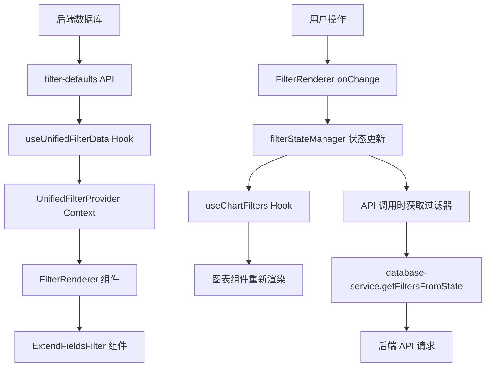

---

## 📦 过滤器配置与数据存储详解

### 1. **过滤器配置存储位置**

#### 1.1 后端配置存储
**位置：** 后端数据库 `filter_defaults` 表
**API 端点：** `GET /api/v1/dashboard/projects/{project_id}/filter-defaults`

```sql
-- filter_defaults 表结构示例
CREATE TABLE filter_defaults (
    id SERIAL PRIMARY KEY,
    project_id VARCHAR(255) NOT NULL,
    chart_name VARCHAR(255) NOT NULL,
    filter_name VARCHAR(255) NOT NULL,
    filter_values JSONB,           -- 默认选中值
    options JSONB,                 -- 所有可选项
    is_visible BOOLEAN DEFAULT true,
    created_at TIMESTAMP DEFAULT NOW(),
    updated_at TIMESTAMP DEFAULT NOW()
);
```

**配置示例：**
```json
{
  "chartName": "market-share-analysis",
  "filterName": "extend_fields",
  "filterValues": ["Individual/Unknown", "Package (Multi-pack)"],
  "options": ["Individual/Unknown", "Package (Multi-pack)", "Bundle"],
  "isVisible": true
}
```

#### 1.2 前端配置缓存
**位置：** `frontend/src/components/analysis-db/hooks/use-unified-filter-data.ts`
**缓存存储：** `unifiedFilterCacheStore` (Map 结构)
**缓存时间：** 30分钟

```typescript
// 缓存结构
const unifiedFilterCacheStore = new Map<string, UnifiedFilterCacheState>()

interface UnifiedFilterCacheState {
  data: UnifiedFilterData | null    // 转换后的配置数据
  loading: boolean
  error: string | null
  lastUpdated: number | null        // 缓存时间戳
}
```

#### 1.3 Context 提供配置
**位置：** `frontend/src/components/analysis-db/contexts/unified-filter-context.tsx`
**提供方法：** `getChartConfig(chartName: string)`

```typescript
// 获取特定图表的过滤器配置
const chartConfig = getChartConfig('market-share-analysis')
// 返回结构：
{
  chartName: "market-share-analysis",
  filters: {
    categories: { values: [...], options: [...], isVisible: true },
    brands: { values: [...], options: [...], isVisible: true },
    extend_fields: { values: {...}, options: [...], isVisible: true },
    time_period: { values: "year", options: [...], isVisible: true }
  }
}
```

### 2. **过滤器选择数据存储**

#### 2.1 全局状态管理器
**位置：** `frontend/src/components/analysis-db/stores/filter-state-manager.ts`
**存储结构：** `GlobalFilterState` (内存存储)

```typescript
// 全局状态结构
interface GlobalFilterState {
  [chartName: string]: ChartFilterState
}

// 单个图表的过滤器状态
interface ChartFilterState {
  filters: {
    categories?: string[]                    // 类别过滤器
    brands?: string[]                       // 品牌过滤器
    segments?: string[]                     // 细分过滤器
    extend_fields?: Record<string, any>     // 扩展字段过滤器
  }
  timeframe?: {
    period?: string                         // 时间周期
  }
  metadata?: {
    lastUpdated?: number                    // 最后更新时间
    appliedAt?: number                      // 应用时间
    syncedFromProject?: boolean             // 是否从项目级同步
    syncTimestamp?: number                  // 同步时间戳
  }
}
```

#### 2.2 状态管理器操作方法
```typescript
// 获取图表过滤器状态
const chartFilters = filterStateManager.getChartFilters('market-share-analysis')

// 更新图表过滤器状态
filterStateManager.updateChartFilters('market-share-analysis', {
  filters: {
    categories: ['Electronics', 'Home & Garden'],
    extend_fields: { package_type: ['Individual/Unknown'] }
  },
  timeframe: { period: 'year' }
})

// 重置图表过滤器
filterStateManager.resetChartFilters('market-share-analysis')
```

#### 2.3 Hook 层面的状态管理
**位置：** `frontend/src/components/analysis-db/hooks/use-filter-state-manager.ts`

```typescript
// 通用状态管理 Hook
const {
  getChartFilters,
  updateChartFilters,
  resetChartFilters,
  getAllFilters
} = useFilterStateManager()

// 图表特定状态管理 Hook
const {
  filters,                    // 当前过滤器状态
  updateCategories,          // 更新类别
  updateExtendFields,        // 更新扩展字段
  updateTimeframe,           // 更新时间框架
  resetFilters              // 重置过滤器
} = useChartFilters('market-share-analysis')
```

### 3. **数据流向图**



### 4. **存储层级关系**

```
📁 存储层级
├── 🗄️ 后端数据库 (filter_defaults 表)
│   ├── 配置数据 (默认值、可选项、可见性)
│   └── 持久化存储
│
├── 🧠 前端内存存储
│   ├── 📋 配置缓存 (unifiedFilterCacheStore)
│   │   ├── 30分钟缓存
│   │   └── 按项目ID分组
│   │
│   └── 🎛️ 状态管理器 (filterStateManager)
│       ├── 用户选择的过滤器值
│       ├── 按图表名称分组
│       └── 实时状态同步
│
└── ⚛️ React 组件状态
    ├── Context 状态 (配置数据)
    ├── Hook 状态 (响应式更新)
    └── 组件本地状态 (UI 交互)
```

### 5. **关键存储位置速查表**

| 数据类型 | 存储位置 | 生命周期 | 访问方式 |
|---------|---------|---------|---------|
| **过滤器配置** | 后端数据库 | 持久化 | API 调用 |
| **配置缓存** | `unifiedFilterCacheStore` | 30分钟 | `useUnifiedFilterData` |
| **用户选择** | `filterStateManager` | 页面会话 | `useChartFilters` |
| **组件状态** | React State | 组件生命周期 | `useState/useEffect` |
| **Context 数据** | `UnifiedFilterProvider` | Provider 生命周期 | `useUnifiedFilter` |

### 6. **扩展字段特殊存储**

#### 6.1 扩展字段定义存储
**位置：** `frontend/src/components/analysis-db/filters/extend-fields-filter/hooks/useExtendFieldsData.ts`
**缓存：** `extendFieldsCache` (Map 结构)

```typescript
// 扩展字段缓存结构
const extendFieldsCache = new Map<string, {
  fieldDefinitions: ExtendFieldDefinition[]    // 字段定义
  projectData: ProjectData | null              // 项目数据分布
  timestamp: number                            // 缓存时间戳
  loading: boolean                             // 加载状态
}>()

// 字段定义结构
interface ExtendFieldDefinition {
  field_name: string                           // 字段名称
  display_name: string                         // 显示名称
  field_type: 'select' | 'multi_select' | 'range' | 'boolean'
  sort_order: number                           // 排序顺序
  filter_options: {
    options?: Record<string, string | number>  // 可选项
    min?: number                               // 最小值 (range 类型)
    max?: number                               // 最大值 (range 类型)
    step?: number                              // 步长 (range 类型)
    default?: any                              // 默认值
  }
}
```

#### 6.2 扩展字段 API 端点
- **字段定义：** `GET /api/v1/dashboard/projects/{project_id}/extend-fields`
- **项目数据：** `GET /api/v1/dashboard/projects/{project_id}/overview`

### 7. **数据同步机制**

#### 7.1 项目级过滤器同步
当图表名称为 `'project'` 时，会触发全局同步：

```typescript
// 项目级过滤器特殊处理
if (isProjectFilter) {
  // 🆕 自动同步到所有已注册的图表（约定优于配置）
  filterStateManager.syncProjectFiltersToAllCharts(chartState)

  // 触发全局刷新信号
  triggerGlobalRefresh()
}
```

**🔄 自动同步机制：**
- 所有使用了 `useChartWithFilters` Hook 的图表都会自动接收项目级过滤器同步
- 无需在代码中硬编码图表列表，新增图表自动支持同步
- 可通过 `enableGlobalSync: false` 参数选择性退出同步

#### 7.2 全局同步事件
**事件类型：** `GLOBAL_SYNC`
**监听位置：** `useChartWithFilters` Hook

```typescript
// 监听全局同步事件
useEffect(() => {
  const unsubscribe = filterStateManager.subscribe((event) => {
    if (event.type === 'GLOBAL_SYNC' &&
        event.affectedCharts.includes(chartName)) {
      // 更新本地过滤器状态
      setFilters(syncedFilters)
      // 自动刷新数据
      refreshData(syncedFilters)
    }
  })
  return unsubscribe
}, [chartName, refreshData])
```

### 8. **重渲染机制存储**

#### 8.1 重渲染回调存储
**位置：** `useExtendFieldsData.ts`
**存储：** `rerenderCallbacks` (Set 结构)

```typescript
// 全局重渲染通知回调存储
const rerenderCallbacks = new Set<() => void>()

// 注册重渲染回调
export function registerExtendFieldsRerenderCallback(callback: () => void): () => void {
  rerenderCallbacks.add(callback)
  return () => rerenderCallbacks.delete(callback)
}
```

#### 8.2 Context 版本管理
**位置：** `UnifiedFilterProvider`
**状态：** `extendFieldsVersion` (number)

```typescript
// Context 中的版本管理
const [extendFieldsVersion, setExtendFieldsVersion] = useState(0)

const triggerExtendFieldsRerender = useCallback(() => {
  setExtendFieldsVersion(prev => prev + 1)
}, [])
```

### 9. **调试和监控**

#### 9.1 状态快照获取
```typescript
// 获取完整状态快照
const stateSnapshot = filterStateManager.getStateSnapshot()
console.log('当前所有图表过滤器状态:', stateSnapshot)

// 获取特定图表状态
const chartState = filterStateManager.getChartFilters('market-share-analysis')
console.log('市场份额分析过滤器状态:', chartState)
```

#### 9.2 缓存状态检查
```typescript
// 检查配置缓存状态
const { filterData, isLoading, error } = useUnifiedFilterData(projectId)
console.log('配置缓存状态:', { filterData, isLoading, error })

// 检查扩展字段缓存
const { fieldDefinitions, projectData, loading } = useExtendFieldsData(projectId)
console.log('扩展字段缓存状态:', { fieldDefinitions, projectData, loading })
```

### 10. **实际配置示例**

#### 10.1 后端数据库配置示例
```sql
-- 为 market-share-analysis 图表配置过滤器
INSERT INTO filter_defaults (project_id, chart_name, filter_name, filter_values, options, is_visible) VALUES
('proj_123', 'market-share-analysis', 'categories', '["Electronics", "Home & Garden"]', '["Electronics", "Home & Garden", "Sports", "Books"]', true),
('proj_123', 'market-share-analysis', 'brands', '[]', '["Apple", "Samsung", "Sony", "LG"]', true),
('proj_123', 'market-share-analysis', 'time_period', '"year"', '["month", "quarter", "year"]', true),
('proj_123', 'market-share-analysis', 'extend_fields', '{"package_type": ["Individual/Unknown"]}', '["Individual/Unknown", "Package (Multi-pack)", "Bundle"]', true);
```

#### 10.2 前端状态示例
```typescript
// filterStateManager 中的实际状态
{
  "market-share-analysis": {
    filters: {
      categories: ["Electronics", "Home & Garden"],
      brands: ["Apple", "Samsung"],
      segments: [],
      extend_fields: {
        package_type: ["Individual/Unknown", "Package (Multi-pack)"],
        price_range: [10, 500]
      }
    },
    timeframe: {
      period: "year"
    },
    metadata: {
      lastUpdated: 1703123456789,
      appliedAt: 1703123456789,
      syncedFromProject: false
    }
  },
  "brand-analysis": {
    filters: {
      categories: ["Electronics"],
      brands: [],
      segments: ["Premium"],
      extend_fields: {}
    },
    timeframe: {
      period: "quarter"
    },
    metadata: {
      lastUpdated: 1703123456789,
      appliedAt: 1703123456789,
      syncedFromProject: true,
      syncTimestamp: 1703123456789
    }
  }
}
```

### 11. **最佳实践和注意事项**

#### 11.1 配置管理最佳实践
```typescript
// ✅ 正确：使用常量确保一致性
import { CHART_NAMES } from '@/components/analysis-db/constants'
const chartConfig = getChartConfig(CHART_NAMES.MARKET_SHARE_ANALYSIS)

// ❌ 错误：硬编码字符串
const chartConfig = getChartConfig('market-share-analysis')
```

#### 11.2 状态更新最佳实践
```typescript
// ✅ 正确：使用便捷方法
const { updateExtendFields } = useChartFilters(chartName)
updateExtendFields({ package_type: ['Individual/Unknown'] })

// ✅ 正确：批量更新
updateChartFilters(chartName, {
  filters: { categories: ['Electronics'] },
  timeframe: { period: 'year' }
})

// ❌ 错误：直接修改状态对象
chartFilters.filters.categories.push('New Category') // 不会触发重新渲染
```

#### 11.3 缓存管理最佳实践
```typescript
// ✅ 正确：检查缓存有效性
const cached = extendFieldsCache.get(projectId)
if (cached && cached.timestamp && (Date.now() - cached.timestamp) < 30 * 60 * 1000) {
  // 使用缓存数据
}

// ✅ 正确：清理过期缓存
export function clearExtendFieldsCache(projectId?: string) {
  if (projectId) {
    extendFieldsCache.delete(projectId)
  } else {
    extendFieldsCache.clear()
  }
}
```

#### 11.4 错误处理最佳实践
```typescript
// ✅ 正确：完整的错误处理
try {
  const chartData = await databaseService.getChartData(projectId)
  return chartData
} catch (error) {
  console.error(`Failed to load chart data for ${chartName}:`, error)
  // 提供用户友好的错误信息
  throw new Error('数据加载失败，请稍后重试')
}
```

### 12. **性能优化建议**

#### 12.1 缓存策略
- **配置缓存：** 30分钟有效期，减少 API 调用
- **状态缓存：** 内存存储，页面会话期间保持
- **组件缓存：** 使用 `React.memo` 避免不必要的重渲染

#### 12.2 批量操作
```typescript
// ✅ 推荐：批量更新多个图表
filterStateManager.batchUpdateFilters({
  'market-share-analysis': { filters: { categories: ['Electronics'] } },
  'brand-analysis': { filters: { categories: ['Electronics'] } }
})

// ❌ 避免：逐个更新
updateChartFilters('market-share-analysis', { filters: { categories: ['Electronics'] } })
updateChartFilters('brand-analysis', { filters: { categories: ['Electronics'] } })
```

#### 12.3 懒加载
```typescript
// ✅ 推荐：动态导入减少初始包大小
const refreshFunction = async (projectId: string, filters: ProjectFilters) => {
  const { databaseService } = await import('@/components/analysis-db/data/database-service')
  return await databaseService.getChartData(projectId)
}
```

