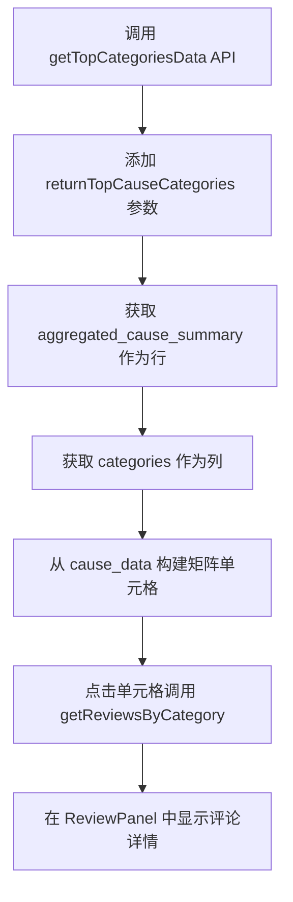

# Top Cause Categories Matrix 设计文档

## 📋 需求背景

在Review Analysis模块中，需要添加一个新的矩阵图表组件，用于展示**原因类别（Cause Categories）**与**方面类别（Aspect Categories）**之间的关系分析。

### 业务价值
- 帮助用户理解用户在提到某个方面时的具体原因分布
- 提供原因类别与方面类别的交叉分析视图
- 支持点击查看具体评论详情的交互功能

## 🎯 功能需求

### 核心功能
1. **矩阵展示**：原因类别 × 方面类别的二维矩阵
2. **数据可视化**：单元格显示评论提及数量，颜色编码表示满意度
3. **交互功能**：点击单元格查看相关评论详情
4. **集成位置**：作为Review Analysis模块的第4个图表组件

### 技术要求
- 复用现有API和数据服务
- 支持过滤器和加载状态
- 类型安全的TypeScript实现
- 响应式设计

## 🏗️ 设计方案

### 矩阵结构设计

| 维度 | 说明 | 数据来源 |
|------|------|----------|
| **行（Rows）** | 原因类别（Cause Categories） | `aggregated_cause_summary` |
| **列（Columns）** | 方面类别（Aspect Categories） | `categories` |
| **单元格** | 评论提及数量 + 满意度颜色编码 | `cause_data` |

### 与现有Competitor Analysis Matrix的对比

| 维度 | Competitor Analysis Matrix | Top Cause Categories Matrix |
|------|---------------------------|----------------------------|
| **行** | Aspect Categories | **Cause Categories** |
| **列** | Products (ASINs) | **Aspect Categories** |
| **数据范围** | 特定选中的产品 | 项目下所有过滤的产品 |
| **单元格含义** | 每个产品在每个方面的评论数 | 每个原因在每个方面的提及数 |
| **分析目的** | 产品间的方面对比 | **原因与方面的关系分析** |

## 🔧 技术实现

### 数据流程



### API调用方式

```typescript
// 复用现有方法，添加cause analysis参数
const result = await databaseService.getTopCategoriesData(
  projectId,
  'phy_perf',
  {
    maxCategories: 10,  // 后端控制方面类别数量
    returnTopCauseCategories: {
      limit: 10  // 后端控制原因类别数量
    }
  },
  filters
)
```

### 数据映射策略

```typescript
// 输入数据结构 (来自 top-categories API)
interface ReviewAnalysisData {
  categories: Array<{
    category_pk: number
    category_name: string
    definition: string
    cause_data: Array<{
      cause_category_pk: number
      cause_category_name: string
      total_reviews: number
      positive_reviews: number
      negative_reviews: number
    }>
  }>
  aggregated_cause_summary: Array<{
    cause_category_pk: number
    cause_category_name: string
    total_reviews: number
    total_positive_reviews: number
    total_negative_reviews: number
    rank: number
  }>
}

// 输出矩阵结构
interface MatrixData {
  rows: Array<{
    causeCategoryId: number
    causeCategoryName: string
    cells: Record<number, {  // key为aspectCategoryId
      reviews: number
      positiveCount: number
      negativeCount: number
      satisfactionRate: number
    } | null>
  }>
  columns: Array<{
    aspectCategoryId: number
    aspectCategoryName: string
  }>
}
```

## 📁 文件结构

### 需要创建的文件
```
frontend/src/components/analysis-db/charts/
└── top-cause-categories-matrix.tsx  # 新的矩阵组件
```

### 需要修改的文件
```
frontend/src/components/analysis-db/review-insights/
└── review-insights.tsx  # 集成新组件
```

### 不需要修改的部分
- ❌ 后端API - 已经完善支持cause analysis
- ❌ 新的数据服务方法 - 复用现有的 `getTopCategoriesData`
- ❌ 新的API端点 - 使用现有的 `/review-analysis/top-categories`

## 🎨 UI设计

### 组件结构
```jsx
<TopCauseCategoriesMatrix
  matrixData={matrixData}
  projectId={projectId}
  aspectType="phy_perf"
  filters={initialFilters}
/>
```

### 集成位置
```jsx
{/* 在 Review Insights 页面的最底部 */}
<section data-chart-id="top-cause-categories-matrix">
  <ChartHeader title="Top Cause Categories Matrix" icon={BarChart3} />
  <div className="bg-blue-50 border-l-4 border-blue-600 p-4 mb-6">
    Matrix showing the relationship between cause categories (rows) and aspect categories (columns). 
    Numbers represent review mentions, colors indicate satisfaction rates.
  </div>
  <div className="bg-white rounded-lg shadow-sm border border-gray-200 p-6 mt-6">
    {matrixLoading ? (
      <div className="flex items-center justify-center p-8">
        <div className="text-gray-500">Loading matrix data...</div>
      </div>
    ) : (
      <TopCauseCategoriesMatrix ... />
    )}
  </div>
</section>
```

### 样式设计
- **表格布局**：使用HTML table实现矩阵结构
- **颜色编码**：
  - 绿色：满意度 ≥ 75%
  - 黄色：满意度 50-74%
  - 橙色：满意度 25-49%
  - 红色：满意度 < 25%
  - 灰色：无数据
- **交互效果**：hover效果、点击反馈、加载状态

## 🔄 实现步骤

### Phase 1: 组件创建
1. 创建 `top-cause-categories-matrix.tsx` 组件
2. 实现数据映射逻辑
3. 实现矩阵渲染和样式
4. 实现点击交互功能

### Phase 2: 集成到页面
1. 在 `review-insights.tsx` 中添加导入
2. 添加状态管理（matrixData, matrixLoading）
3. 添加数据获取方法（fetchMatrixData）
4. 更新过滤器变化和初始化逻辑
5. 添加UI section

### Phase 3: 测试和优化
1. 修复TypeScript类型错误
2. 确保build通过
3. 测试数据加载和交互功能
4. 验证与现有系统的兼容性

## ⚠️ 注意事项

### 后端依赖
- 需要确保 `/api/v1/dashboard/charts/review-analysis/top-categories` API 支持 `return_top_cause_categories` 参数
- 需要确保返回的数据结构包含 `aggregated_cause_summary` 和 `cause_data` 字段

### 类型安全
- 所有API响应需要正确的TypeScript类型定义
- 注意处理可选字段（如 `aspects?`）
- 确保sentiment类型为联合类型 `'positive' | 'negative' | 'neutral'`

### 性能考虑
- 矩阵大小限制：最多10行10列
- 数据量控制：通过后端参数控制
- 懒加载：点击时才获取评论详情

## 🧪 测试计划

### 功能测试
- [ ] 矩阵正确渲染
- [ ] 数据正确映射
- [ ] 颜色编码正确
- [ ] 点击交互正常
- [ ] 过滤器功能正常
- [ ] 加载状态正确

### 兼容性测试
- [ ] 与现有Review Analysis模块集成
- [ ] 不影响其他图表组件
- [ ] 响应式设计在不同屏幕尺寸下正常

### 性能测试
- [ ] 大数据量下的渲染性能
- [ ] API调用效率
- [ ] 内存使用情况

## 📝 实施检查清单

### 开发阶段
- [ ] 后端API确认支持cause analysis
- [ ] 创建TopCauseCategoriesMatrix组件
- [ ] 集成到ReviewInsights页面
- [ ] 修复所有TypeScript错误
- [ ] 确保build通过

### 测试阶段
- [ ] 本地功能测试
- [ ] 数据正确性验证
- [ ] 交互功能测试
- [ ] 兼容性测试

### 部署阶段
- [ ] 代码review
- [ ] 合并到目标分支
- [ ] 部署到测试环境
- [ ] 用户验收测试

## 💻 核心代码示例

### 组件接口定义

```typescript
interface TopCauseCategoriesMatrixProps {
  matrixData: TopCauseCategoriesMatrixData | null
  projectId: string
  aspectType?: 'phy_perf' | 'use'
  filters?: {
    categories?: string[]
    brands?: string[]
    segments?: string[]
    extend_fields?: Record<string, any>
    asins?: string[]
  }
}
```

### 数据获取方法

```typescript
const fetchMatrixData = async (filters?: ProjectFilters) => {
  if (!projectId) return

  setMatrixLoading(true)
  try {
    const result = await databaseService.getTopCategoriesData(
      projectId,
      'phy_perf',
      {
        sortBy: 'total_reviews',
        sortDirection: 'desc',
        maxCategories: 10,
        minReviews: 3,
        returnTopCauseCategories: {
          limit: 10
        }
      },
      filters
    )
    setMatrixData(result)
  } catch (error) {
    console.error('Error fetching matrix data:', error)
  } finally {
    setMatrixLoading(false)
  }
}
```

### 点击交互处理

```typescript
const handleCellClick = async (cellData: CellData) => {
  try {
    setCellClickLoading(true)

    const reviewsResponse = await databaseService.getReviewsByCategory(
      projectId,
      cellData.aspectCategoryId,
      { limit: 100, offset: 0, sortBy: 'review_id', sortOrder: 'desc' },
      filters
    )

    const reviewsToShow = reviewsResponse.data.reviews.map(review => ({
      id: review.review_id.toString(),
      productId: review.product_id,
      text: review.review_text,
      sentiment: /* 情感分析逻辑 */,
      category: cellData.aspectCategoryName,
      // ... 其他字段映射
    }))

    openPanel(reviewsToShow, title, subtitle, options)
  } catch (error) {
    console.error('Error fetching reviews:', error)
  } finally {
    setCellClickLoading(false)
  }
}
```

## 🐛 已知问题和解决方案

### 问题1: TypeScript类型错误
**问题**: `review.aspects` 可能为 undefined
**解决方案**: 使用可选链操作符 `review.aspects?.map(...) || []`

### 问题2: 属性名不匹配
**问题**: API返回的字段名与前端期望不一致
**解决方案**:
- `product_brand` → `brand`
- `total_reviews` → `total_count`
- 添加类型断言确保sentiment类型正确

### 问题3: JSX结构错误
**问题**: pricing-analysis.tsx中有重复的闭合标签
**解决方案**: 移除多余的 `)}` 和未匹配的条件渲染括号

## 🔄 版本历史

### v1.0 (2025-01-08)
- 初始设计文档
- 完整的技术方案
- 实现步骤规划

### 后续版本规划
- v1.1: 添加性能优化方案
- v1.2: 添加国际化支持
- v1.3: 添加导出功能

---

**文档版本**: v1.0
**创建日期**: 2025-01-08
**最后更新**: 2025-01-08
**负责人**: AI Agent

**相关文件**:
- `frontend/src/components/analysis-db/charts/top-cause-categories-matrix.tsx`
- `frontend/src/components/analysis-db/review-insights/review-insights.tsx`
- `frontend/src/components/analysis-db/data/database-service.ts`
