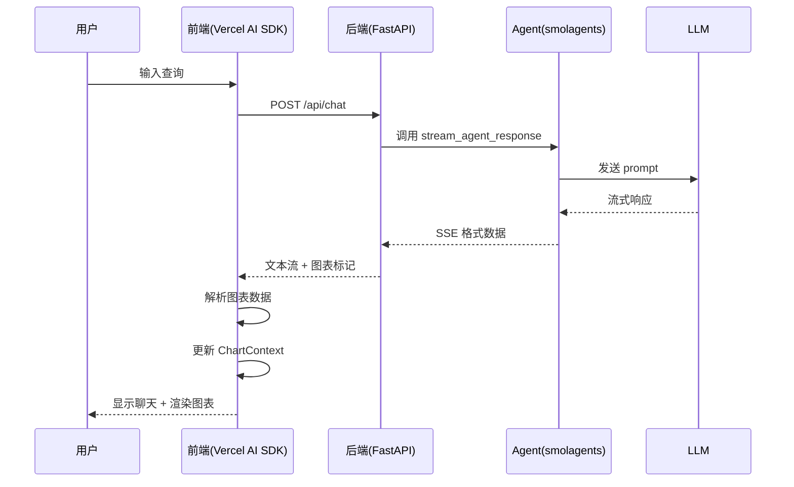

# Leviton Agent 前后端整合技术方案

## 项目概述

将现有的 FastAPI + smolagents 后端与 Next.js 前端通过 Vercel AI SDK 整合，实现用户通过聊天界面输入命令生成数据分析图表的功能。

### 目标

- 用户在前端聊天界面输入数据分析需求
- 后端 Agent 处理请求并生成图表代码
- 前端实时展示流式响应并渲染图表

### 当前状态

- **后端**: FastAPI + smolagents，通过 URL 参数触发，输出 SSE 格式数据
- **前端**: Next.js + 模拟 API，静态图表展示
- **问题**: 前后端未整合，数据流不通

## 技术架构设计

### 整体架构

```
用户输入 → 前端(Vercel AI SDK) → 后端(FastAPI + smolagents) → LLM → 图表代码 → 前端渲染
```

### 技术栈

#### 前端

- **框架**: Next.js 14+ (App Router)
- **AI SDK**: Vercel AI SDK (`ai`, `@ai-sdk/react`)
- **UI**: 现有的 shadcn/ui + Tailwind CSS
- **图表**: Recharts
- **状态管理**: Vercel AI SDK 内置状态 + Chart Context

#### 后端

- **框架**: FastAPI (保持不变)
- **Agent**: smolagents (保持不变)
- **流式输出**: Server-Sent Events (SSE)
- **新增**: Vercel AI SDK 兼容端点

## 接口契约设计

### 1. 聊天接口 (新增)

#### 端点

```
POST /api/chat
```

#### 请求格式

```typescript
interface ChatRequest {
  messages: Array<{
    id: string;
    role: 'user' | 'assistant';
    content: string;
  }>;
}
```

#### 响应格式

- **协议**: Text Stream Protocol
- **Content-Type**: `text/plain`
- **编码**: UTF-8, 流式输出

#### 示例

```bash
# 请求
curl -X POST http://localhost:8000/api/chat \
  -H "Content-Type: application/json" \
  -d '{
    "messages": [
      {"id": "1", "role": "user", "content": "显示最近6个月的销售趋势"}
    ]
  }'

# 响应 (流式)
正在分析销售数据...
生成趋势图表...
[图表代码和分析结果]
```

### 2. 图表数据提取契约

#### 后端输出格式标识

```typescript
// 在流式响应中使用特殊标记来标识图表数据
interface ChartMarkers {
  CHART_START: '<<<CHART_START>>>';
  CHART_END: '<<<CHART_END>>>';
  CHART_TYPE: '<<<CHART_TYPE:${type}>>>';
  INSIGHTS_START: '<<<INSIGHTS_START>>>';
  INSIGHTS_END: '<<<INSIGHTS_END>>>';
}
```

#### 图表数据格式

```typescript
interface ChartData {
  timestamp: number;
  type: 'single' | 'multiple';
  // 单图表
  code?: string;
  explanation?: string;
  insights?: string;
  // 多图表
  chart1?: {
    code: string;
    explanation: string;
    insights: string;
  };
  chart2?: {
    code: string;
    explanation: string;
    insights: string;
  };
}
```

## 后端实现方案

### 1. 新增 Vercel AI SDK 兼容端点

```python
# main.py - 添加新的路由
@app.post("/api/chat")
async def chat_with_vercel_ai_sdk(request: dict):
    """
    Vercel AI SDK 兼容的聊天端点
    输入: {"messages": [{"role": "user", "content": "..."}]}
    输出: 文本流 (Text Stream Protocol)
    """
    try:
        messages = request.get("messages", [])
        if not messages:
            raise HTTPException(status_code=400, detail="Messages are required")
      
        # 提取最新的用户消息
        latest_message = messages[-1].get("content", "") if messages else ""
        if not latest_message:
            raise HTTPException(status_code=400, detail="Latest message content is required")
      
        logger.info(f"Processing chat request: {latest_message}")
      
        # 使用现有的流式响应生成器
        return StreamingResponse(
            convert_sse_to_text_stream(latest_message),
            media_type="text/plain",
            headers={
                "Cache-Control": "no-cache",
                "Connection": "keep-alive",
                "X-Accel-Buffering": "no",  # Nginx 代理优化
            }
        )
    except Exception as e:
        logger.error(f"Chat endpoint error: {e}")
        raise HTTPException(status_code=500, detail=str(e))

async def convert_sse_to_text_stream(query: str):
    """
    将现有的 SSE 格式转换为 Vercel AI SDK 兼容的文本流
    """
    try:
        async for sse_chunk in stream_agent_response(query):
            if sse_chunk.startswith("data: "):
                try:
                    # 解析 SSE 数据
                    data = json.loads(sse_chunk[6:])  # 移除 "data: " 前缀
                  
                    status = data.get("status", "")
                    message = data.get("message", "")
                  
                    if message and status in ["streaming", "processing", "completed"]:
                        # 添加图表标记以便前端识别
                        if is_chart_content(message):
                            formatted_message = format_chart_content(message)
                            yield formatted_message
                        else:
                            yield message
                          
                except json.JSONDecodeError:
                    logger.warning(f"Failed to parse SSE data: {sse_chunk}")
                    continue
                except Exception as e:
                    logger.error(f"Error processing SSE chunk: {e}")
                    continue
                  
    except Exception as e:
        logger.error(f"Stream conversion error: {e}")
        yield f"错误: {str(e)}"

def is_chart_content(message: str) -> bool:
    """判断消息是否包含图表内容"""
    chart_indicators = [
        "ResponsiveContainer",
        "LineChart", "BarChart", "PieChart", "ScatterChart",
        "import { ", "export default function",
        "const data =", "const DynamicChart"
    ]
    return any(indicator in message for indicator in chart_indicators)

def format_chart_content(message: str) -> str:
    """格式化图表内容，添加标记"""
    # 提取图表代码、说明和洞察
    chart_info = extract_chart_info(message)
  
    if chart_info:
        formatted = f"""
<<<CHART_START>>>
<<<CHART_TYPE:{chart_info['type']}>>>
{chart_info['code']}
<<<CHART_END>>>

<<<INSIGHTS_START>>>
{chart_info['explanation']}

{chart_info['insights']}
<<<INSIGHTS_END>>>
"""
        return formatted
  
    return message

def extract_chart_info(content: str) -> dict:
    """从内容中提取图表信息"""
    # 这里需要根据 smolagents 的实际输出格式来实现
    # 示例实现:
    import re
  
    # 提取图表代码
    code_match = re.search(r'```(?:tsx?|javascript|jsx?)?\n(.*?)```', content, re.DOTALL)
    code = code_match.group(1).strip() if code_match else ""
  
    # 提取图表类型
    chart_type = "line"  # 默认类型
    if "BarChart" in code:
        chart_type = "bar"
    elif "PieChart" in code:
        chart_type = "pie"
    elif "ScatterChart" in code:
        chart_type = "scatter"
  
    # 提取说明和洞察 (需要根据实际格式调整)
    explanation = extract_explanation(content)
    insights = extract_insights(content)
  
    return {
        "type": chart_type,
        "code": code,
        "explanation": explanation,
        "insights": insights
    } if code else None

def extract_explanation(content: str) -> str:
    """提取图表说明"""
    # 根据实际输出格式实现
    # 示例: 查找 "explanation" 或 "说明" 相关内容
    return "图表说明信息"  # 占位符

def extract_insights(content: str) -> str:
    """提取数据洞察"""
    # 根据实际输出格式实现
    # 示例: 查找 "insights" 或 "洞察" 相关内容
    return "数据洞察信息"  # 占位符
```

### 2. 配置更新

```python
# config.py - 添加 CORS 配置
class Settings:
    # ... 现有配置 ...
  
    # CORS 设置 - 添加前端地址
    ALLOWED_ORIGINS: list = [
        "http://localhost:3000",  # Next.js 开发服务器
        "https://leviton-agent.vercel.app",  # 生产环境
        "*"  # 开发阶段，生产环境需要具体化
    ]
```

## 前端实现方案

### 1. 安装依赖

```bash
# 在 step7-frontend-chart-agent 目录下
npm install ai @ai-sdk/react
```

### 2. 环境配置

```typescript
// .env.local
NEXT_PUBLIC_BACKEND_URL=http://localhost:8000
```

### 3. 替换聊天接口

```typescript
// src/components/chat/chat-interface.tsx
'use client';

import { useChat } from 'ai/react';
import { useState, useEffect } from 'react';
import { Button } from '@/components/ui/button';
import { Textarea } from '@/components/ui/textarea';
import { ScrollArea } from '@/components/ui/scroll-area';
import { Send, MessageSquare } from 'lucide-react';
import { MessageList } from './message-list';
import { useChart } from '@/contexts/chart-context';

export function ChatInterface() {
  const { updateChart, setCompiling, setError } = useChart();
  const [isExtracting, setIsExtracting] = useState(false);

  const { 
    messages, 
    input, 
    handleInputChange, 
    handleSubmit, 
    isLoading,
    error 
  } = useChat({
    api: `${process.env.NEXT_PUBLIC_BACKEND_URL}/api/chat`,
    streamProtocol: 'text',
    headers: {
      'Content-Type': 'application/json',
    },
    onResponse: (response) => {
      if (!response.ok) {
        setError(`服务器错误: ${response.status}`);
        return;
      }
      setCompiling(true);
      setError(null);
    },
    onFinish: (message) => {
      setCompiling(false);
      setIsExtracting(true);
    
      // 提取和处理图表数据
      const chartData = extractChartFromMessage(message.content);
      if (chartData) {
        updateChart(chartData);
      }
    
      setIsExtracting(false);
    },
    onError: (error) => {
      setCompiling(false);
      setError(`连接失败: ${error.message}`);
    }
  });

  // 提取图表数据的函数
  function extractChartFromMessage(content: string): any {
    try {
      // 查找图表标记
      const chartStartIndex = content.indexOf('<<<CHART_START>>>');
      const chartEndIndex = content.indexOf('<<<CHART_END>>>');
    
      if (chartStartIndex === -1 || chartEndIndex === -1) {
        return null;
      }

      // 提取图表类型
      const typeMatch = content.match(/<<<CHART_TYPE:(\w+)>>>/);
      const chartType = typeMatch ? typeMatch[1] : 'line';

      // 提取图表代码
      const chartSection = content.substring(
        chartStartIndex + '<<<CHART_START>>>'.length,
        chartEndIndex
      );
    
      const codeStart = chartSection.indexOf('>>>') + 3;
      const code = chartSection.substring(codeStart).trim();

      // 提取洞察
      const insightsStartIndex = content.indexOf('<<<INSIGHTS_START>>>');
      const insightsEndIndex = content.indexOf('<<<INSIGHTS_END>>>');
    
      let explanation = '';
      let insights = '';
    
      if (insightsStartIndex !== -1 && insightsEndIndex !== -1) {
        const insightsSection = content.substring(
          insightsStartIndex + '<<<INSIGHTS_START>>>'.length,
          insightsEndIndex
        );
      
        const insightsParts = insightsSection.trim().split('\n\n');
        explanation = insightsParts[0] || '';
        insights = insightsParts[1] || insightsParts[0] || '';
      }

      return {
        timestamp: Date.now(),
        type: 'single' as const,
        code,
        explanation,
        insights,
        chartType
      };
    } catch (error) {
      console.error('解析图表数据失败:', error);
      setError('图表数据解析失败');
      return null;
    }
  }

  const handleFormSubmit = (e: React.FormEvent) => {
    e.preventDefault();
    if (!input.trim() || isLoading) return;
  
    setError(null);
    handleSubmit(e);
  };

  // 显示错误信息
  useEffect(() => {
    if (error) {
      setError(error.message || '未知错误');
    }
  }, [error, setError]);

  return (
    <div className="h-full flex flex-col bg-background">
      {/* 标题栏 */}
      <div className="flex-shrink-0 border-b bg-background/95 backdrop-blur">
        <div className="flex items-center gap-2 p-4">
          <MessageSquare className="h-5 w-5" />
          <h2 className="font-semibold">AI 数据分析助手</h2>
          {isLoading && (
            <div className="flex items-center gap-2 text-sm text-muted-foreground">
              <div className="animate-spin h-4 w-4 border-2 border-primary border-t-transparent rounded-full" />
              生成中...
            </div>
          )}
          {isExtracting && (
            <div className="flex items-center gap-2 text-sm text-muted-foreground">
              <div className="animate-pulse h-4 w-4 bg-primary rounded-full" />
              解析图表...
            </div>
          )}
        </div>
      </div>

      {/* 消息列表 */}
      <ScrollArea className="flex-1 p-4">
        <div className="space-y-4">
          {messages.length === 0 && (
            <div className="text-center text-muted-foreground py-8">
              <MessageSquare className="h-12 w-12 mx-auto mb-4 opacity-50" />
              <p className="text-lg font-medium mb-2">欢迎使用 AI 数据分析助手</p>
              <p className="text-sm">
                询问关于数据的任何问题，我会为您生成相应的图表来可视化展示
              </p>
              <div className="mt-4 text-xs space-y-1">
                <p>• "显示最近6个月的销售趋势"</p>
                <p>• "对比各产品的销量表现"</p>
                <p>• "分析用户增长情况"</p>
              </div>
            </div>
          )}
        
          {messages.map((message) => (
            <div
              key={message.id}
              className={`flex gap-3 ${
                message.role === 'user' ? 'justify-end' : 'justify-start'
              }`}
            >
              <div
                className={`max-w-[80%] rounded-lg px-4 py-2 ${
                  message.role === 'user'
                    ? 'bg-primary text-primary-foreground'
                    : 'bg-muted'
                }`}
              >
                <div className="whitespace-pre-wrap text-sm">
                  {message.content}
                </div>
              </div>
            </div>
          ))}
        </div>
      </ScrollArea>

      {/* 输入框 */}
      <div className="flex-shrink-0 border-t p-4">
        <form onSubmit={handleFormSubmit} className="flex gap-2">
          <Textarea
            value={input}
            onChange={handleInputChange}
            placeholder="询问关于数据的任何问题..."
            className="min-h-[40px] max-h-[120px] resize-none"
            disabled={isLoading}
            onKeyDown={(e) => {
              if (e.key === 'Enter' && !e.shiftKey) {
                e.preventDefault();
                handleFormSubmit(e);
              }
            }}
          />
          <Button 
            type="submit" 
            size="icon"
            disabled={isLoading || !input.trim()}
          >
            <Send className="h-4 w-4" />
          </Button>
        </form>
      
        <p className="text-xs text-muted-foreground mt-2 text-center">
          按 Enter 发送，Shift + Enter 换行
        </p>
      </div>
    </div>
  );
}
```

### 4. 更新类型定义

```typescript
// src/lib/types.ts
export interface ChartData {
  timestamp: number;
  type: 'single' | 'multiple';
  chartType?: string;
  
  // 单图表格式
  code?: string;
  explanation?: string;
  insights?: string;
  
  // 多图表格式
  chart1?: {
    code: string;
    explanation: string;
    insights: string;
  };
  chart2?: {
    code: string;
    explanation: string;
    insights: string;
  };
  chart3?: {
    code: string;
    explanation: string;
    insights: string;
  };
}

export interface ChatMessage {
  id: string;
  role: 'user' | 'assistant';
  content: string;
  timestamp: number;
  chartData?: ChartData;
}
```

## 数据流设计

### 完整数据流



## 错误处理策略

### 后端错误处理

```python
# 在 convert_sse_to_text_stream 中
try:
    async for sse_chunk in stream_agent_response(query):
        # ... 处理逻辑
        pass
except asyncio.TimeoutError:
    yield "请求超时，请稍后重试"
except Exception as e:
    logger.error(f"Stream processing error: {e}")
    yield f"处理请求时出现错误: {str(e)}"
```

### 前端错误处理

```typescript
// 在 useChat 配置中
const { messages, ... } = useChat({
  // ... 其他配置
  onError: (error) => {
    console.error('Chat error:', error);
    setError(`连接失败: ${error.message}`);
    setCompiling(false);
  },
  onResponse: (response) => {
    if (!response.ok) {
      setError(`服务器错误: ${response.status} ${response.statusText}`);
      return;
    }
    setError(null);
  }
});
```

## 开发和部署配置

### 本地开发

```bash
# 后端启动 (在 backend 目录)
uvicorn main:app --reload --host 0.0.0.0 --port 8000

# 前端启动 (在 step7-frontend-chart-agent 目录)
npm run dev  # 端口 3000
```

### 环境变量配置

#### 后端 (.env)

```bash
# 现有配置保持不变
MODEL_ID=google/gemini-2.5-pro-preview
API_KEY=your_api_key
MCP_ACCESS_TOKEN=your_token

# 新增 CORS 配置
ALLOWED_ORIGINS=http://localhost:3000,https://your-frontend-domain.vercel.app
```

#### 前端 (.env.local)

```bash
NEXT_PUBLIC_BACKEND_URL=http://localhost:8000
# 生产环境使用: https://your-backend-domain.com
```

## 测试验证

### 1. 接口测试

```bash
# 测试新的聊天接口
curl -X POST http://localhost:8000/api/chat \
  -H "Content-Type: application/json" \
  -d '{
    "messages": [
      {"id": "1", "role": "user", "content": "显示销售数据趋势图"}
    ]
  }'
```

### 2. 端到端测试流程

1. 启动后端服务 (端口 8000)
2. 启动前端服务 (端口 3000)
3. 在前端输入测试问题
4. 验证流式响应显示
5. 验证图表生成和渲染

### 3. 示例测试用例

- "显示最近6个月的销售趋势"
- "对比各产品的销量表现"
- "生成用户增长的饼图"
- "分析季度收入变化"

## 协作开发指南

### 前端开发者任务

1. 安装 Vercel AI SDK 依赖
2. 替换 `ChatInterface` 组件，使用 `useChat` 钩子
3. 实现 `extractChartFromMessage` 函数
4. 更新错误处理和加载状态
5. 测试与后端接口的连通性

### 后端开发者任务

1. 新增 `/api/chat` 端点
2. 实现 `convert_sse_to_text_stream` 函数
3. 实现图表内容识别和格式化逻辑
4. 更新 CORS 配置
5. 测试接口输出格式

### 接口联调清单

- [ ] 前端能成功调用 `/api/chat` 接口
- [ ] 后端正确解析 messages 数组
- [ ] 流式数据传输正常
- [ ] 图表标记格式正确
- [ ] 前端能正确解析图表数据
- [ ] 图表渲染功能正常
- [ ] 错误处理机制生效

## 预期效果

实施后的效果：

1. **简化前端代码**: 减少 ~150 行状态管理代码
2. **统一数据流**: 所有聊天状态由 Vercel AI SDK 管理
3. **保持后端稳定**: smolagents 逻辑完全不变
4. **提升用户体验**: 更流畅的实时响应和错误处理
5. **易于维护**: 标准化的接口和清晰的数据流

通过这个方案，前后端开发者可以并行工作，通过明确的接口契约确保最终集成的成功。
